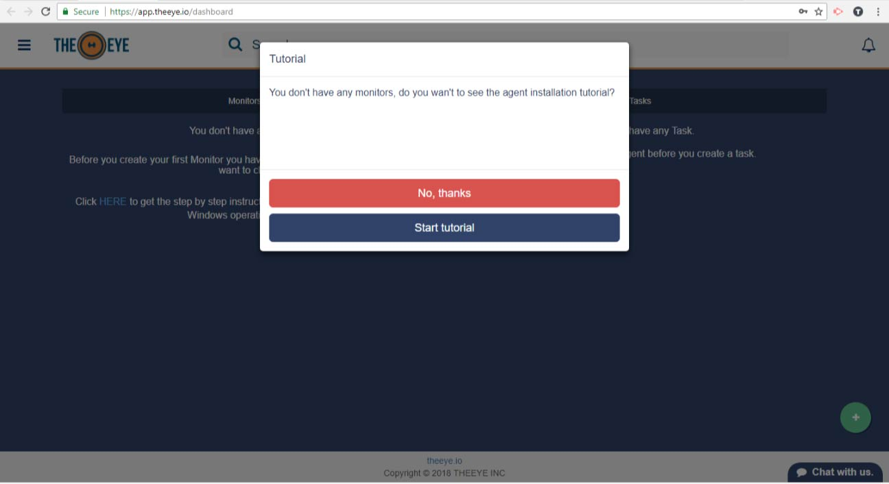

# Contents
#### [What is TheEye?](#what-is-theeye-1)
#### [First Steps](#first-steps-1)
  * ##### [Agent Installation](#agent-installation-1)
  * ##### [Check your first resource](#check-your-first-resource-1)

#### [User Management](#users)
#### [Organization](#organization-1)

## Resources
#### [Monitors](#monitors-1)
#### [Tasks](#tasks-1)
#### [Webhooks](#webhooks-1)
#### [Provisioning](#provisioning-1)

#### [Scripts](#scripts-1)
#### [Integrations](#integrations-1)

## Other Tools
+ [TheEye_Cli Util](cli)
+ [Build Agent Binary](agent/binary_build.md)
+ [Agent Docs](agent)
----

### What is TheEye
    * A remote server managament and a monitoring tool (Devops)
    * A server provisioning tool
    * A task manager (with scheduler)
    * A Workflow creation tool (IFTTT)
    * A technical repository
    * An integration platform
    * A Real time support tool
    
    
If you want start from the scratch, there's a native integration with ELK and Docker: 
[TheEye MindMap](https://atlas.mindmup.com/2017/11/5fa49fd0c43311e7b5da733708907222/theeye_functional_mindmap_es/index.html)

### First Steps
To start using ThEye you will need:
1. A user account. To get an user: https://theeye.io/register
2. Install an agent on each server you would like to perform actions.
3. Create yor first resource from TheEye Web.

Once you've activated your user account, you'll see this Dasboard after login:

#### Agent Installation
If it is the first time you access TheEye Website, click the link in the monitors panel where says "Click HERE to get the step by step instructions to install the Agent on Linux and Windows operating systems", otherwise go to "settings" in the left menu and get to the "installation" section. Installation instructions are provided for Linux and Windows systems.

+ Linux:

+ Windows:

#### Check your first resource
Check the Dashboard view after login, you should see "All up and running" in the monitors panel.

------------------------------

### Users
TheEye provides six different user roles. You can create users on the go with the appropiate role.
See the [Users Management Documentation](users) for more details.

### Resources

#### Monitors
A monitor is used to check services' or resources' status. You can use this status information to take actions (e.g. run a task, send notification).
You can always customize the time between checks.

There're five kind of monitors you can set up from TheEye: Stats, Script, API/Web Check, Process and File.
Check the [Monitors Documentation](monitors) for more details.

#### Tasks
A task is like a job, it can be performed or executed on demand. You can also use the task scheduler to create and manage tasks that TheEye will carry out automatically at the times you specify. Check the [Tasks Documentation](tasks) for more details.

#### Scripts
You can write scripts directly from TheEye web to your servers or you can create scripts to be used as API Calls or monitors.
Check the [Scripts Documentation](scripts) for more details.

#### Provisioning (Templates)

One of the main advantages brought by TheEye is the fact that all your technical stuff is stashed at the moment it is created (scripts, tasks, monitors). Provisioning allows you to reuse your stuff for other servers in the same way a template works.
To reuse all the resources created for a server, go to _Povisioning_ in the left menu, select your source host in the _base template_ input box, set a name for the template and select your destination hosts in the _Hosts to add to the template_ input box. All the resources from your source host will now be available on your destinations hosts. 

#### Webhooks
Un incoming webhook es una forma de acceder desde otro sistema, a su vez genera un link que al llamar la instrucción puede ejecutarla, si es que está vinculada a una tarea (o serie de tareas)

Las tareas se pueden ejecutar con trigger on y eso arma el Workflow.

# Workflow

Un Workflow nos sirve para ver como está la estructura de las tareas, cómo se realizan y cuál es su orden correlativo.
Por ej una tarea simple de un reinicio de servicio, el Workflow lo veremos de la siguiente manera:

En cambio un Workflow del tipo Webhook, lo veremos totalmente diferente:

