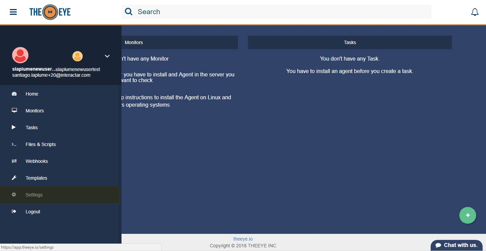

# Contents
  - [What is TheEye?](#what-is-theeye)
  - [First Steps](#first-steps)
    - [Agent Installation](#agent-installation)
    - [Check your first resource](#check-your-first-resource)

  - [User Management](#users)
  - Organization
  - [Integrations](integrations)

  - Resources
    - [Monitors](#monitors)
    - [Tasks](#tasks)
    - [Provisioning](#provisioning-templates)
    - [Webhooks](#webhooks)
    - [Scripts](#scripts)

  - [Workflow](#workflow)

  - Other Tools
    - [TheEye_Cli Util](cli)
    - [Build Agent Binary](agent/binary_build.md)
    - [Agent Docs](agent)

------------------

## What is TheEye
  * A remote server managament and a monitoring tool (Devops)
  * A server provisioning tool
  * A task manager (with scheduler)
  * A Workflow creation tool (IFTTT)
  * A technical repository
  * An integration and automation platform
  * A Real time support tool

If you want start from the scratch, there's a native integration with ELK and Docker.
Check this out [TheEye MindMap](https://atlas.mindmup.com/2017/11/7f1f2fb0d53611e7a974c121a32f69bf/theeye_functional_mindmap_es/index.html)

## First Steps
To start using TheEye you will need to:

  1. Have a user account. If you don't have one go to https://theeye.io/register and create one.
  2. Install an [Agent](agent/install.md) on each server you would like to perform actions or automate from.
  3. Create your first resource from TheEye Web.

Once you've activated your user account, you'll see this Dashboard after login:

The Tutorial will guide you through the install process of an [Agent](agent/install.md) and create a task.

In case you don't want to follow the tutorial, you can install the agents on your own following instructions from Settings->Installer in the side menu.

### Agent Installation
If it is the first time you access TheEye Website, click the link in the monitors panel where says _"Click HERE to get the step by step instructions to install the Agent on Linux and Windows operating systems"_, otherwise go to _Settings_ in the left menu and get to the _Installation_ section. Installation instructions are provided for Linux and Windows systems.

+ Linux:

+ Windows:

+ Docker

After each agent installation a new monitor is shown up in the Dashboard.

For detailed installation information check the [Agent:install document](agent/install.md)

### Check your first resource

Check the Dashboard view after login, you should see "All up and running" in the monitors panel.

------------------------------

### Users
TheEye provides six different user roles. You can create users on the go with the appropiate role.
See the [Users Management Documentation](users) for more details.

## Resources
TheEye provides a way to store technical knowledge in Resources that become usable in many different aspects. Each resource is explained hereunder.

### Monitors
A monitor is used to check services' or resources' status. You can use this status information to take actions (e.g. run a task, send notification).
You can always customize the time between checks.

There are five kind of monitors you can set up from TheEye: Stats, Script, API/Web Check, Process and File.
Check the [Monitors Documentation](monitors) for more details.

+ Monitors will notify for events as desired. Check the Users ACLs' section for [Notifications](users#acls-1)

### Tasks
A task is an action that can be performed or executed on demand. You can also use the task scheduler to create and manage tasks that TheEye will carry out automatically at the times you specify. Check the [Tasks Documentation](tasks) for more details.

### Scripts
You can write scripts directly from TheEye web to your servers or you can create scripts to be used as API Calls or monitors.
Check the [Scripts Documentation](scripts) for more details.

### Provisioning (Templates)

One of the main advantages brought by TheEye is the fact that all your technical stuff is stashed at the moment it is created (scripts, tasks, monitors). Provisioning allows you to reuse your stuff for other servers in the same way a template works.
To reuse all the resources created for a server, go to _Povisioning_ in the left menu, select your source host in the _base template_ input box, set a name for the template and select your destination hosts in the _Hosts to add to the template_ input box.
All the resources from your source host will now be available on your destination hosts.

### Webhooks

A webhook can be used to perform an action when an event occurs on other website. When that event occurs, the source site makes an HTTP request to the URL configured for the webhook.

To create a webhook (incoming webhook), just go to the _Webhooks_ section left menu, and click on "_+ new Incoming webhook_". Name it and save it. Once you have saved it, expand it, by clicking over the webhook box, you'll be able to see the URL assigned to the webhook.

The webhook you created can be used as a trigger for other resources (e.g. You can set the webhook to be the trigger of a task) as shown hereunder.

## Workflow

Workflow connects your tasks together to automate complex or dependent processes.

Which trigger would you like to use?
You can start a workflow directly with a play button or you can use monitors or tasks as triggers.

Check the [Workflow Documentation](workflow) for more details.
