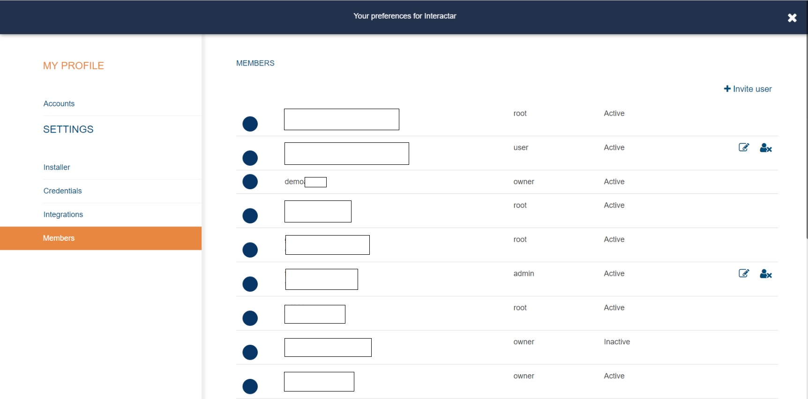

# Users Documentation

# Contents

### User Accounts and Credential types
#### Permissions
#### Effective permissions per credential type
### Members Page (CRUD Users)
----------
User Accounts and Credential types (Web/Mobile access)
======================================================

_There're 6 user profiles, each type has different permissions._

## Permissions
1. Full Control
    * Can manage organizations.
    * Has all the permissions listed hereunder.
2. Full Access
    * Can view all the resources that belongs to the organization.
3. View 
    * Can view tasks and ouput logs.
4. Execution
    * Can view and execute tasks.
5. Create and Modify
    * Can create and modify resources (e.g. create scripts, create tasks, assign ACLs to tasks)
6. User Admin
    * Add and delete users
    * Set user credential (admin/manager/user/viewer)

_Note:_ **Users will have access to resources provided by ACLs. Only user types with _Full Access_ permission will be able to see all resources.**

### Effective permissions per credential type

1. **root**
    * Full Control
    
2. **owner**
    * Full Access
    * Create and Modify
    * Execution
    * User Admin

3. **admin**
    * Full Access
    * Create and Modify
    * Execution

4. **user**
    * View
    * Execution

5. **viewer**
    * View

6. **manager**
    * User Admin
    * View
    * Execution

## Members Page
To Create or modify users, go to _Settings_ from the left menu and then go to _Members_ section.

When you invite a new user, you will be prompted to select the user's credential type(admin/user/viewer/manager). You can always change the user's credential type at any time.
The user account must be activated by the activation link sent by email.
